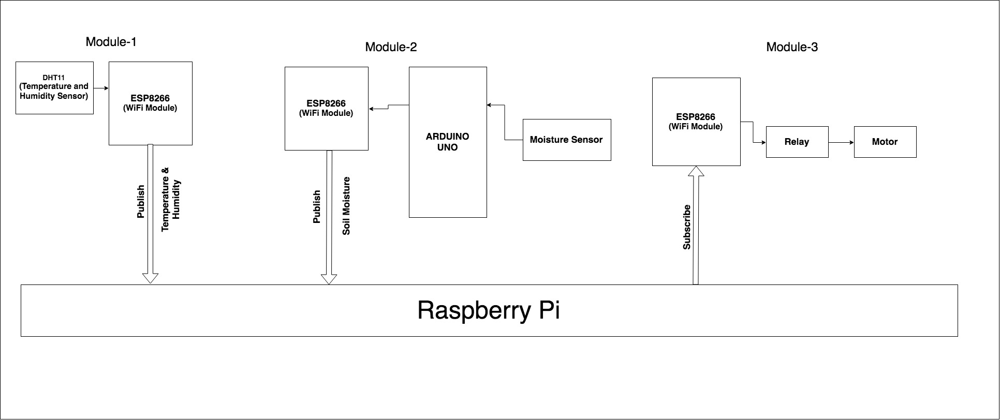
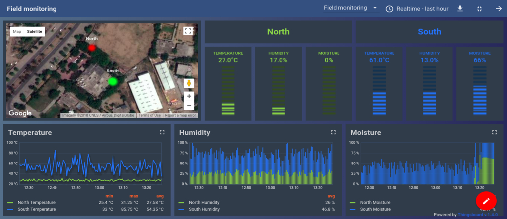

# IoT Based Smart Agriculture System

The project aims at making use of evolving technology i.e. IoT and smart agriculture using automation. Monitoring environmental factors are the major factor to improve the yield of efficient crops. The feature of this project includes monitoring temperature, humidity, and moisture in the agricultural field through sensors DHT11, YL69. It will turn ON/OFF motor based on soil moisture.

## Modules:

### Module-1:

In the first module, we are using the ESP8266 Wi-Fi module that will act as a microcontroller and it will be attached to a DHT11 to sense the current temperature and humidity. The module will publish the temperature and humidity data to the MQTT broker i.e Raspberry Pi.

#### Component Used:

**• ESP8266 ESP-01:** It is a low power consuming Wi-Fi module with an integrated TCP/IP protocol stack that can give any microcontroller access to the WiFi network. It is a self-contained SOC (System On a Chip) that doesn’t necessarily need a microcontroller to manipulate inputs and outputs.

**• DHT11:** It is a temperature and humidity sensor that generates calibrated digital output for temperature and humidity. It uses a humidity sensor and thermistor to measure the surrounding environment. It has a fast response and excellent quality.

### Module-2:

In the second module, we are using Arduino as a microcontroller that will get the soil moisture through a moisture sensor and publish it to the MQTT broker by using the ESP8266 Wi-Fi module.

#### Component Used:

**• Arduino Uno:** It is a microcontroller board based on the ATmega328. It has 14 digital I/O pins and 6 analog pins. It just needs to connect to a computer with a USB cable to upload the code and powered through an AC to DC adapter or a battery.

**• YL-69:** It is a soil moisture sensor used to measure the water content of the soil. It can detect whether the soil is too dry or wet. This sensor uses the two probes to pass current through the soil, and then it reads that resistance to get the moisture level.

**• ESP8266 ESP-01**

### Module-3:

In this module ESP8266, WiFi Module works as a subscriber who subscribes to the moisture data from the MQTT Broker(Rasberry Pi). ESP8266 connected to relay i.e connected to the motor and it will turn the motor ON/OFF based on soil moisture.

#### Component Used:

**• Relay:** A relay is an electrically operated switch. It means that it can be turned on or off, letting the current going through or not. when a relay contact is normally open (NO), there is an open contact when the relay is not energized. When a relay contact is Normally Closed (NC), there is a closed contact when the relay is energized.

**• ESP8266 ESP-01**

### Raspberry Pi as a Broker:

MQTT (Message Queue Telemetry Transport) is a lightweight messaging protocol for small devices and sensors. It is a publisher-Subscriber based model. A publisher can publish data to broker and subscribers can subscribe topic from the broker. So, the broker plays a very important role as a middle man.

In this project, we are creating raspberry pi as a broker. To make it broker, we are using a Mosquitto MQTT i.e open-source implementation of a message broker. Raspberry Pi as a broker receives Temperature and Humidity data with a specific topic from the Arduino microcontroller as described in module1 and also receives soil moisture data with topic information as mentioned in module 2.

Now subscriber as module 3 here can subscribe to data from the broker by specifying the topic name.

## Code Details:

This project is based on two areas **North** and **South** both are using their own module 1 & 2 to publish temperature, humidity, and moisture.

**Subscriber (Module-3)**: it is using two-channel Realy that will turn on/off motors based on soil moisture of a particular area.

### Visulization:

I am using [ThingsBoard](https://thingsboard.io/) to visualize data i.e great open-source IoT platform for data visualize real-time data.
**dataSubscriber.py**: This Script is used to subscribe to data of all areas from the broker and write it into different text files.

**thingsboardNorth.py and thingsboardSouth.py**: These Scripts will scrap data from text files and upload them to ThingsBoard Server.

[Link To Dashboard](https://demo.thingsboard.io/dashboards/d7455310-065d-11e8-83e6-1d8d2edf4f93?publicId=2ade3530-f6a2-11e7-abe9-1d8d2edf4f93)

## Wiring:

### Module 1

**ESP8266 ESP-01**

Vcc -------------------------------------- 3.3V  
Gnd -------------------------------------- Gnd  
Pin 2 -------------------------------------- DHT Data pin

**DHT11**  
Vcc -------------------------------------- 5V  
Gnd -------------------------------------- Gnd  
Data -------------------------------------- ESP Pin 2

### Module 2

**YL-69 Soil Sensor**&nbsp;&nbsp;&nbsp;&nbsp;&nbsp;&nbsp;&nbsp;&nbsp;&nbsp;&nbsp;&nbsp;&nbsp;&nbsp;&nbsp;**Arduino UNO**  
Vcc -------------------------------------- 5V  
Gnd -------------------------------------- Gnd  
A0 --------------------------------------- A0

**ESP8266 ESP-01**&nbsp;&nbsp;&nbsp;&nbsp;&nbsp;&nbsp;&nbsp;&nbsp;&nbsp;&nbsp;&nbsp;&nbsp;&nbsp;&nbsp;&nbsp;&nbsp;&nbsp;**Arduino UNO**  
Vcc --------------------------------------- 3.3V  
Gnd -------------------------------------- Gnd  
Rx --------------------------------------- Pin 7  
Tx --------------------------------------- Pin 8

### Module 3

**Relay(2 Channel)**  
IN1 ------------------------ ESP pin 0  
IN1 ------------------------ ESP pin 2  
Vcc ------------------------ 5V  
Gnd ------------------------ Gnd
